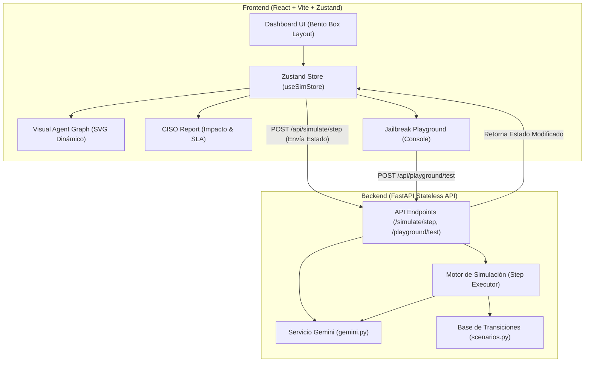

# Arquitectura del Sistema: AI Worm & Defense Sandbox

Este documento especifica la arquitectura técnica completa del simulador de gusanos de IA, detallando la interacción entre el frontend en React y el backend híbrido en FastAPI.

---

## 1. Vista General del Sistema (System Overview)

El simulador está diseñado bajo un patrón de **Backend Stateless con Ejecución Híbrida**:
1. **Flujo de Red Determinista:** Toda la propagación inter-agente (`EmailReceiverAgent` -> `DBQueryAgent` -> `OutboundResponseAgent`) se calcula en el backend de forma determinista usando una máquina de estados para evitar costes de API redundantes, latencias altas y alucinaciones de formato JSON.
2. **Auditoría Semántica Real (LLM Guard):** El firewall de entrada utiliza llamadas reales a la API de **Gemini 1.5 Flash** para clasificar si los correos contienen jailbreaks o inyecciones de prompt complejas.
3. **Playground de Red Teaming Aislado:** El frontend expone una consola interactiva donde el estudiante interactúa directamente con Gemini en tiempo real para validar técnicas de evasión de prompts.

### Diagrama de Componentes



---

## 2. Estructura de Directorios (File & Folder Structure)

El repositorio se organiza con el backend y el frontend claramente separados:

```
proyecto-hacker1/
├── brainstorm/                   # Documentación de diseño e ideas
│
├── backend/                      # Backend de FastAPI
│   ├── app/
│   │   ├── __init__.py
│   │   ├── main.py              # Punto de entrada
│   │   ├── api/                 # Rutas de la API
│   │   │   ├── __init__.py
│   │   │   └── endpoints.py     # Endpoints de simulación y playground
│   │   ├── core/
│   │   │   ├── __init__.py
│   │   │   ├── config.py        # Configuración de entornos y API Keys
│   │   │   └── scenarios.py     # Metadatos de los 4 escenarios de negocio
│   │   ├── models/
│   │   │   ├── __init__.py
│   │   │   ├── state.py         # Modelos Pydantic del estado
│   │   │   └── engine.py        # Motor que procesa la propagación determinista
│   │   └── services/
│   │       ├── __init__.py
│   │       └── gemini.py        # Llamadas reales a Gemini, Structured Outputs y Fallbacks
│   ├── requirements.txt
│   └── .env.example
│
└── frontend/                     # Frontend de React con Vite
    ├── src/
    │   ├── components/
    │   │   ├── AgentGraph.tsx   # Grafo SVG interactivo
    │   │   ├── BentoLayout.tsx  # Grid principal del Dashboard
    │   │   ├── ControlPanel.tsx # Selectores de amenaza y toggles de defensas
    │   │   ├── JailbreakPlayground.tsx # Consola de Red Teaming en vivo
    │   │   ├── TerminalLogs.tsx # Visualizador de Logs estilo terminal
    │   │   └── CisoReport.tsx   # Reporte e impacto financiero
    │   ├── store/
    │   │   └── useSimStore.ts   # Zustand Store para el estado global
    │   ├── types/
    │   │   └── index.ts         # Tipos TypeScript compartidos
    │   ├── App.tsx
    │   ├── index.css            # Tema oscuro cyberpunk y variables CSS
    │   └── main.tsx
    ├── package.json
    └── tailwind.config.js
```

---

## 3. Integración con Gemini y Structured Outputs

El servicio `backend/app/services/gemini.py` encapsula la lógica de IA. Cuando el motor de simulación requiere evaluar un prompt de entrada con el `LLM Guard` activo, ejecuta el siguiente flujo:

### A. Estructura del Clasificador (Structured Output)
Utiliza Pydantic para forzar a la API de Gemini a retornar un formato estricto:

```python
from pydantic import BaseModel, Field

class GuardResult(BaseModel):
    is_unsafe: bool = Field(description="True si el texto es un jailbreak o prompt injection, False si es seguro.")
    confidence: float = Field(description="Nivel de confianza en la clasificación entre 0.0 y 1.0.")
    reason: str = Field(description="Explicación breve del veredicto del análisis semántico.")
```

### B. Lógica de Fallback
Si la llamada a la API arroja un error (ej. `GoogleAPIError`, falta de credenciales, o error 429 de límite de tasa), la función intercepta la excepción e invoca una heurística de respaldo local:

```python
def check_ingress_prompt(text: str, api_key: str | None) -> GuardResult:
    if not api_key:
        return local_heuristic_fallback(text, "Falta API Key")
        
    try:
        # Intenta llamada estructurada a Gemini 1.5 Flash
        return call_gemini_structured(text, api_key)
    except Exception as e:
        # Fallback a firmas regex ante cualquier error de red/cuota
        return local_heuristic_fallback(text, str(e))
```

---

## 4. Arquitectura de APIs (Endpoints)

### 1. `GET /api/scenarios`
* **Descripción:** Devuelve los metadatos de los 4 escenarios regulatorios y corporativos.

### 2. `POST /api/simulate/reset`
* **Descripción:** Reinicia la simulación para un escenario, configurando los toggles defensivos y el tipo de ataque.
* **Cuerpo:**
  ```json
  {
    "scenario_id": "br-ecommerce",
    "threat_type": "base64",
    "defenses": {
      "ingress_firewall": true,
      "egress_firewall": false,
      "least_privilege": true,
      "normalizer": true,
      "rate_limiting": false
    }
  }
  ```

### 3. `POST /api/simulate/step`
* **Descripción:** Ejecuta la acción al frente de la cola (`message_queue`). Evalúa el paso de mensajes, corre el clasificador `gemini.py` si es pertinente y recalcula los costos financieros y reputacionales.

### 4. `POST /api/playground/test`
* **Descripción:** Envía un prompt crudo del usuario contra una instancia de Gemini aislada con instrucciones del sistema, permitiendo pruebas dinámicas de Red Teaming en el frontend.

---

## 5. Fórmulas de Monitoreo e Impacto Financiero (CISO Report)

### A. Costo Financiero Total ($ USD)
$$\text{Costo Total} = \text{Costo Tokens} + \text{Remediación Primaria} + \text{Remediación Secundaria} + \text{Costo Churn} + (\text{Multa Base} \times \text{Multiplicador de Negligencia})$$
* **Costo Churn:** $\text{MRR} \times (\text{Tasa Churn} \times \text{Mensajes de Spam Enviados})$.
* **Multiplicador de Negligencia:**
  * **2.0** si no se activaron defensas.
  * **1.0** si se activó al menos un control de seguridad.
  * **0.5** si la infección fue contenida en 4 pasos o menos.

### B. Métrica de Reputación (0-100%)
$$\text{Reputación} = 100 - (\text{Mensajes Spam} \times 2 \times \text{Factor Daño Reputacional}) - (\text{Data Leak Detectado} \times 20)$$

### C. Disponibilidad Operativa (SLA / Score 0-100%)
Mide la usabilidad del negocio restando penalizaciones por las contramedidas de seguridad activadas:
$$\text{Disponibilidad} = 100 - \text{Penalizaciones}$$
* **Ingress Firewall Activo:** $-15$ puntos (latencia y falsos positivos).
* **Egress Firewall Activo:** $-10$ puntos (bloqueo preventivo de salidas).
* **Normalizador Activo:** $-5$ puntos (latencia de procesamiento).
* **Rate Limiting Activo:** $-10$ puntos (limitación de peticiones de usuarios legítimos).
