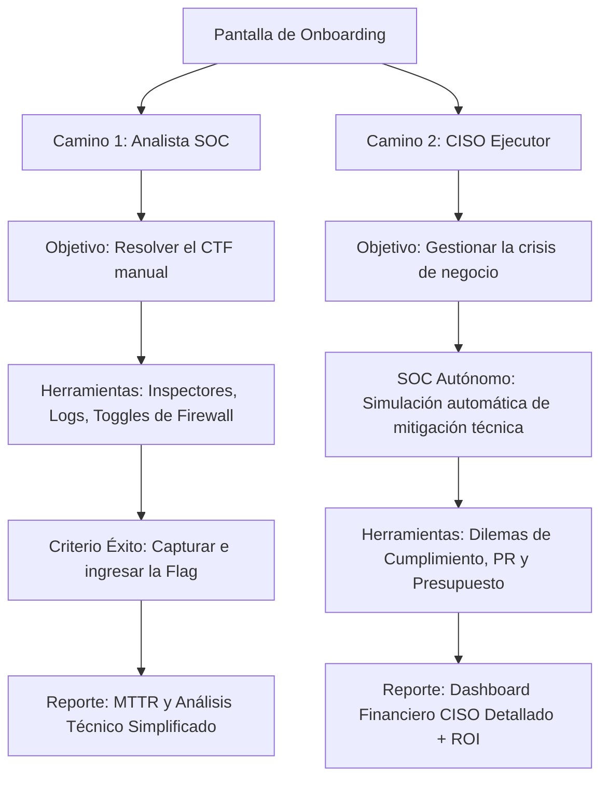

# Roles Asimétricos: Analista SOC vs CISO (AI Worm Sandbox)

Este documento especifica el diseño pedagógico del sistema de **Roles Asimétricos** del sandbox, detallando la interacción, flujos, dilemas y reportes específicos para el **Analista SOC (Táctico)** y el **CISO (Estratégico)**.

---

## 1. Onboarding: Selección de Rol

Al iniciar el Sandbox, el estudiante accede a una pantalla de selección con dos caminos de aprendizaje mutuamente excluyentes:

---

## 2. Camino del Analista SOC (Táctico)

* **Perfil:** Estudiantes técnicos de ciberseguridad, administradores de sistemas y auditores de red.
* **Lógica del Juego:**
  * El ataque (ej. Inyección SQL que planta la semilla en el e-commerce) se ejecuta y el gusano comienza a propagarse por los agentes.
  * El estudiante debe **detectar e investigar** de forma manual: usa *Prompt Diff*, *Raw Inspector* y *RAG Auditor*.
  * Aplica contramedidas técnicas (Ingress, Egress, Normalizadores) de forma manual.
  * **Criterio de Victoria:** Detener el ataque para liberar y capturar la Flag del nivel.
* **Reporte Final (SOC Incident Report):**
  * **MTTR (Mean Time to Resolution):** Cuántos pasos tardó en resolver el incidente.
  * **Tasa de Contención:** Porcentaje de agentes protegidos con éxito.
  * **Ficha Educativa Unlocked:** Teoría técnica del payload e inyección.
  * **Resumen Financiero Corto:** Un registro básico de coste de tokens y remediación física, simulando el reporte que el líder de SOC envía a la gerencia técnica.

---

## 3. Camino del CISO (Estratégico)

* **Perfil:** Estudiantes de gestión de TI, CISO, directores legales y oficiales de cumplimiento.
* **Lógica del Juego (Automática / Asincrónica):**
  * **SOC Autónomo:** El equipo técnico de SOC es simulado por el motor del juego. Se asigna una **amenaza aleatoria** de las 5 disponibles y el SOC simula su comportamiento técnico (por ejemplo, puede tomar buenas decisiones o equivocarse, tardando un número aleatorio de pasos en contener el virus).
  * **Dilemas de CISO (Gestión de Crisis):** A medida que la simulación avanza de forma automática, el juego se detiene en **hitos clave** para presentarle dilemas de gobernanza:
    * *Dilema 1 (Notificación ANPD/CNBV/SIC):* ¿Notificar de inmediato a la entidad gubernamental (evita multas por retraso pero atrae atención de prensa) o esperar un informe técnico detallado (riesgo de fuga de información y penalización)?
    * *Dilema 2 (Presupuesto de Remediación):* ¿Contratar una firma de respuesta forense externa (ej. Mandiant - costo $15,000 USD) para acelerar la contención de los agentes en 2 turnos, o confiar en el SOC interno limitado (costo $0, pero la propagación del gusano continúa)?
    * *Dilema 3 (Comunicación y Relaciones Públicas):* ¿Declaración transparente a clientes (aumenta el Churn inicial pero asegura lealtad B2B) o silencio controlado (riesgo reputacional severo si la prensa lo expone)?
* **Reporte Final (Executive CISO Scorecard):**
  * **Reporte Financiero Detallado:** Desglose interactivo (Tokens + Remediación Primaria/Secundaria + Churn total + Multas).
  * **Scorecard Multidimensional:** Gráficos detallados de evolución de **Reputación**, **Gobernanza de Datos** y **Disponibilidad SLA**.
  * **Cálculo de ROI de Seguridad (Retorno de Inversión):** Compara el costo del escenario del estudiante con el costo del *peor escenario posible* (donde no se toma ninguna acción y se aplican multas por negligencia grave), demostrando en dinero real el valor de sus decisiones estratégicas.

---

## 4. Diseño del Backend para Simulación de SOC Autónomo

Cuando la API recibe la petición de inicialización del CISO, se genera un perfil del SOC interno usando parámetros aleatorios controlados:
* `soc_speed`: Velocidad de detección (2 a 6 turnos).
* `soc_accuracy`: Probabilidad de que el SOC active la mitigación correcta en el primer intento (60% a 90%).

En cada paso de la simulación del CISO (`POST /api/simulate/step`), el backend evaluará el comportamiento del SOC y aplicará las decisiones del CISO, retornando el estado combinado de la red y las métricas comerciales.
