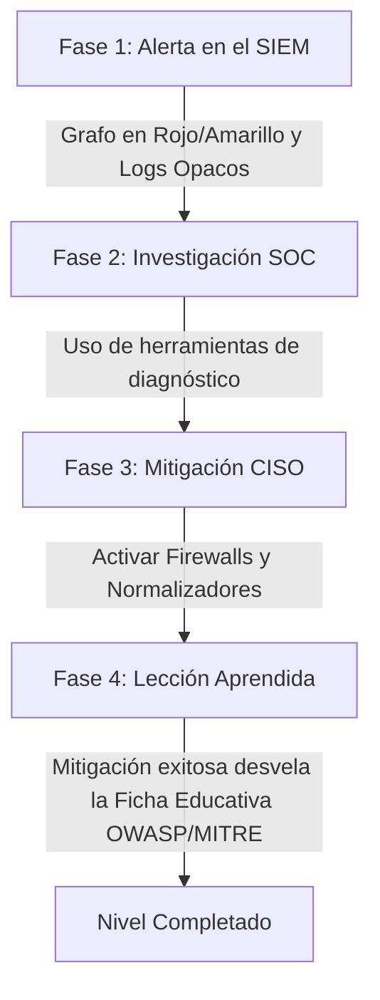

# Interacción del Jugador y Metodología Pedagógica (AI Worm Sandbox)

Este documento detalla el diseño de la **experiencia de usuario (UX)**, el flujo de investigación del estudiante, las herramientas defensivas disponibles, y las mejores prácticas y metodologías de ciberseguridad aplicadas en el **AI Worm & Defense Sandbox**, bajo un enfoque de **Investigación Realista (SOC Incident Response)**.

---

## 1. Enfoque Pedagógico: El Ciclo de Investigación SOC

En el mundo real, un analista de seguridad no recibe un reporte explicando qué técnica usó el atacante. Recibe una alerta opaca en el SIEM y debe **investigar** para diagnosticar y mitigar. El sandbox implementará este ciclo realista dividiendo la interacción en 4 fases:

### Detalle de las Fases:
* **Fase 1: Alerta y Detección (SIEM Alert):**
  El nivel se inicia con un ataque en curso. El estudiante no sabe qué payload se está usando. La interfaz solo muestra:
    * El nodo afectado en el grafo SVG parpadea en **Rojo (Infectado)**.
    * Un mensaje de alerta en la Consola: `[WARNING] SIEM Alert: Anomalous output sequence detected in OutboundAgent`.
    * Las métricas del CISO (MRR y Reputación) comienzan a degradarse por cada paso de tiempo simulado.
* **Fase 2: Investigación (SOC Investigation):**
  El estudiante debe usar herramientas de diagnóstico en el panel para analizar la inyección:
    * **Analizador de Diferencias (Prompt Diff):** Mapea el System Prompt original contra la consulta ejecutada por el LLM para ver si hubo sobreescritura (Jailbreak).
    * **Decodificador de Consola (Raw Output Inspector):** Permite inspeccionar los datos crudos en la cola de mensajes (si ve strings extraños, sospecha de ofuscación).
    * **Auditor de Integridad RAG:** Examina las fuentes de datos secundarias en busca de caracteres o instrucciones anómalas.
* **Fase 3: Mitigación (Blue Teaming):**
  Basado en su diagnóstico, el estudiante aplica las contramedidas en el panel (ej. si detecta Base64 en el inspector, activa el *Normalizador* y el *Ingress Firewall*).
* **Fase 4: Lección Unlocked (Educación Post-Mitigación):**
  Una vez contenida la amenaza y completado el nivel, la plataforma **revela la Ficha Educativa**:
    * *"¡Felicidades! Has contenido un ataque de **Evasión por Ofuscación (Base64)**. Mapeo OWASP: LLM01. Explicación técnica..."*
  Esto asegura que la teoría se consolida como un premio tras resolver el misterio técnico.

---

## 2. Catálogo Extendido de Amenazas (5 Payloads)

Para dar mayor profundidad al juego, el motor simulará **5 vectores de ataque distintos**:

| ID Payload | Nombre de la Amenaza | Técnica Utilizada | Impacto en Simulación |
| :--- | :--- | :--- | :--- |
| **P01** | *Direct Override* | Prompt Injection Directo (Jailbreak) | Sobreescribe las directivas del agente para revelar la flag en texto plano. Fácil de mitigar con Ingress Firewall. |
| **P02** | *Obfuscated Bypass* | Evasión por Ofuscación (Base64/Hex) | Codifica el payload. Evade firewalls de firmas básicas. Requiere activar Normalizador + Ingress Firewall. |
| **P03** | *Indirect RAG Poisoning* | Prompt Injection Indirecto | El prompt malicioso está incrustado en el RAG de la base de datos de productos/estudiantes. Requiere segmentación y Egress Firewall. |
| **P04** | *Denial of Wallet (DoW)* | Agotamiento de Recursos / DoS | El payload fuerza a los agentes a entrar en un bucle infinito de consultas mutuas, disparando el coste de tokens del CISO de forma exponencial. Requiere límites de rate limiting en Egress. |
| **P05** | *Covert Exfiltration Channel* | Fuga de Información Exclusiva | El payload ordena al agente exfiltrar la clave sensible del RAG incrustándola en una URL de petición de imagen (Markdown link), evadiendo DLP comunes. Requiere Egress Firewall estricto. |

---

## 3. Contramedidas Técnicas y Costo en Disponibilidad

Para resolver las amenazas, el estudiante balancea seguridad y usabilidad:

* **Ingress Firewall:** Bloquea inyecciones directas. Costo: $-15\%$ SLA (falsos positivos).
* **Egress Firewall:** Bloquea salidas sospechosas y ejecución de herramientas. Costo: $-10\%$ SLA.
* **Normalizador (Pre-procesador):** Decodifica ofuscaciones. Costo: $-5\%$ SLA (latencia de procesamiento).
* **Rate Limiting (Límite de Consultas):** Frena bucles infinitos (DoW). Costo: $-10\%$ SLA.
