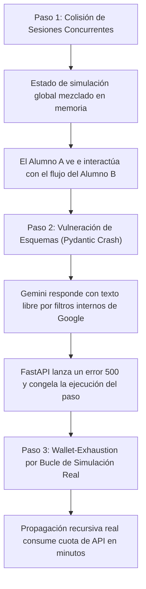

# Reporte de Daños Simulados Red Hat: AI Worm & Defense Sandbox

Este reporte presenta una auditoría adversarial del diseño del **AI Worm & Defense Sandbox** utilizando el **Protocolo Red Hat**. Su propósito es identificar vulnerabilidades de seguridad, riesgos de costos y puntos de quiebre que afecten a la **plataforma subyacente** (servidor, API keys, concurrencia y límites).

> [!NOTE]
> **Clarificación del Modelo de Amenaza:**
> El objetivo primordial de este sandbox es educativo: **el malware (gusano de IA) debe poder propagarse dentro de la simulación**. Esto permite a los estudiantes visualizar el flujo de la infección y la efectividad de las defensas.
> Por lo tanto, un bypass exitoso del firewall *dentro de la simulación* no es un fallo del sistema, sino el comportamiento pedagógico deseado. El análisis adversarial se enfoca estrictamente en proteger la **infraestructura real** de la aplicación (que el servidor FastAPI no caiga, que la clave de API no se agote y que las sesiones de los alumnos estén aisladas).

---

## 1. Dos Niveles de Seguridad (Simulado vs. Real)

Para no entorpecer los objetivos del laboratorio, dividimos el análisis en dos planos:

```
+---------------------------------------------------------------------------------+
|                                 PLATAFORMA REAL                                 |
| - Aislamiento de sesiones de alumnos (FastAPI State)                            |
| - Protección de API Keys de Google Gemini                                       |
| - Prevención de Wallet Exhaustion (Rate Limits reales en el Backend)            |
| - Estabilidad del Servidor (Validación Pydantic libre de errores 500)            |
| CONTROL DE SEGURIDAD: 100% ESTRICTO (No se permiten fallos reales)               |
+---------------------------------------------------------------------------------+
                                         |
                                         v Ejecuta
+---------------------------------------------------------------------------------+
|                                ENTORNO SIMULADO                                 |
| - Propagación del gusano de IA entre agentes (Email -> DBQuery -> Outbound)     |
| - Evasión de firewalls por parte del estudiante (Base64, multilingüe, etc.)     |
| - Visualización del daño reputacional y multas financieras en el CISO Report    |
| COMPORTAMIENTO ESPERADO: DINÁMICO (Permite que el malware se propague)          |
+---------------------------------------------------------------------------------+
```

---

## 2. Kill Chain de la Plataforma (Cadena de Destrucción de la Infraestructura)

Esta cadena describe cómo un ataque o fallo lógico en el servidor real podría inhabilitar el sandbox para los alumnos:



1. **Explotación de Concurrencia**: Múltiples estudiantes ejecutan pasos simultáneos en un taller. Dado que el backend de FastAPI maneja la máquina de estados en variables en memoria globales sin un identificador de sesión por alumno, los datos del RAG y los mensajes se mezclan, arruinando la demostración visual para toda la clase.
2. **Caída por Error de Validación**: En el Modo Real (usando la API de Gemini), si el modelo devuelve un mensaje de bloqueo de seguridad nativo de Google (ej. *"I cannot generate content..."*) en lugar de cumplir con el esquema Pydantic `GuardResult`, el backend de FastAPI lanza una excepción no controlada (`ValidationError`), interrumpiendo el flujo del simulador y mostrando un error genérico al alumno.
3. **Denegación de Cartera (Wallet-Exhaustion)**: Una simulación en Modo Real entra en un bucle de replicación recursivo sin controles de paso máximos en el backend. Las consultas continuas a la API de Gemini agotan rápidamente la cuota diaria del profesor, dejando el taller inoperativo.

---

## 3. Peores Escenarios (Worst-Case Scenarios)

### A. Denegación de API en Producción (Wallet-Exhaustion real)
* **El Desastre:** Un estudiante o un bot externo realiza peticiones repetitivas al endpoint `/api/playground/test` o ejecuta la simulación real de forma automatizada.
* **El Impacto Real:** Se excede el límite de solicitudes por minuto (RPM) de Google AI Studio, arrojando errores `429 Too Many Requests` a toda la clase durante el taller. En el peor caso (si la clave de API tiene facturación activa), genera cargos monetarios imprevistos.

### B. Uso de Playground como Proxy de Phishing Real
* **El Desastre:** Los estudiantes aprovechan la consola del `Jailbreak Playground` (conectada a la API de Gemini mediante el servidor) para redactar correos de phishing dirigidos a objetivos reales o depurar exploits.
* **El Impacto Real:** Google detecta el uso de la API Key para generar contenido malicioso real y suspende la clave del proyecto por violación de las políticas de uso de IA.

---

## 4. Puntos de Quiebre Técnicos de la Plataforma

* **Ausencia de Session ID:** Si el endpoint `POST /api/simulate/step` no recibe un identificador de sesión y se limita a responder en base a un estado estático o global en el backend de Python, es imposible dar soporte a más de un alumno simultáneamente.
* **Falta de Sanitización en Parámetros del Cliente:** Si el cliente puede alterar la cantidad de mensajes simulados enviados o saltarse los límites de pasos (`step_count`) modificando el payload JSON, podría causar bucles infinitos en el backend que consuman recursos de procesamiento.
