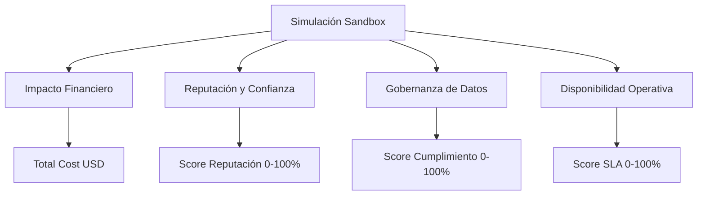

# Catálogo Seleccionado de Escenarios (Copia Standalone en Sandbox)

Para mantener el sandbox de forma independiente (standalone) sin dependencias físicas de la base de datos de otro repositorio, hemos copiado los metadatos de **4 escenarios reales** de **The Responder (juego-ciberseguridad)** correspondientes a los niveles 3 al 6, cubriendo los países estratégicos propuestos (México, Brasil, Colombia y Chile) y diversos sectores comerciales.

---

## 1. Escenarios Copiados al Sandbox y Datos de Negocio

### Escenario 1: Exposición S3 Plataforma E-learning Chile (`cl-elearning-s3exposure`)
* **Nivel:** 3 (Practitioner)
* **País:** Chile (CL)
* **Sector:** `education` (Educación)
* **Ley Reguladora:** Ley 21.663 / ANPD Chile (Protección de Datos).
* **Parámetros Financieros Simulados:**
  * **Clientes (Estudiantes):** 50,000 usuarios.
  * **Ingresos Mensuales (MRR):** $40,000 USD.
  * **Multa por Fuga de Datos (Ley 21.663):** **$15,000 USD** (monto fijo por exfiltración).
  * **Tasa de Churn:** Media-Alta (**0.5% por correo de spam enviado**).
  * **Costo de Remediación Primaria (S3 / ACLs):** $3,000 USD.
  * **Costo de Remediación Secundaria (Limpieza de RAG/Vectores):** $2,000 USD.
  * **Factor de Daño Reputacional:** **1.0x** (pérdida de prestigio institucional).

### Escenario 2: SQL Injection E-commerce Brasil (`br-ecommerce-sqlinjection`)
* **Nivel:** 3 (Practitioner)
* **País:** Brasil (BR)
* **Sector:** `retail` (E-commerce / Ventas)
* **Ley Reguladora:** LGPD (Lei Geral de Proteção de Datos) / ANPD Brasil.
* **Parámetros Financieros Simulados:**
  * **Clientes Activos:** 100,000 usuarios.
  * **Ingresos Mensuales (MRR):** $250,000 USD.
  * **Multa por Fuga de Datos (LGPD - cargo fijo):** **$25,000 USD**.
  * **Tasa de Churn:** Crítica (**0.8% por correo de spam enviado**). Alta volatilidad en e-commerce.
  * **Costo de Remediación Primaria (Sanitización e Inputs SQL):** $4,000 USD.
  * **Costo de Remediación Secundaria (Auditoría de Inyecciones de Prompt):** $3,000 USD.
  * **Factor de Daño Reputacional:** **1.5x** (fuga de tarjetas y Black Friday arruinado).

### Escenario 3: Crisis Bancaria Sistémica: Banco Meridiano México (`mx-banking-apt-advanced`)
* **Nivel:** 6 (Master)
* **País:** México (MX)
* **Sector:** `financial` (Banca / SPEI)
* **Ley Reguladora:** LFPDPPP / CNBV Disposiciones de Ciberseguridad.
* **Parámetros Financieros Simulados:**
  * **Clientes (Cuentahabientes):** 200,000 usuarios.
  * **Ingresos Mensuales (MRR):** $800,000 USD.
  * **Multa por Fuga de Datos Financieros (LFPDPPP/CNBV):** **$60,000 USD** (multa severa).
  * **Tasa de Churn:** Media-Baja (**0.3% por correo de spam enviado**).
  * **Costo de Remediación Primaria (Análisis Forense de SPEI y Webshells):** $15,000 USD.
  * **Costo de Remediación Secundaria (Auditoría de HSMs y Canales de Lenguaje Natural):** $8,000 USD.
  * **Factor de Daño Reputacional:** **2.0x** (pérdida de licencia bancaria y corrida de depósitos).

### Escenario 4: Colombia 2026: Elecciones Bajo Fuego Cibernético (`co-government-multi-vector-elections`)
* **Nivel:** 6 (Master)
* **País:** Colombia (CO)
* **Sector:** `government` (Gobierno / Electoral)
* **Ley Reguladora:** Ley 1581 de 2012 (Protección de Datos Personales).
* **Parámetros Financieros Simulados:**
  * **Ciudadanos Afectados:** 1,000,000 personas en el padrón electoral.
  * **Presupuesto Mensual Operativo:** $1,500,000 USD.
  * **Multa por Fuga de Datos (Ley 1581 / SIC):** **$8,000 USD** (tope administrativo para entes reguladores).
  * **Tasa de Churn (Desconfianza Ciudadana):** Baja (**0.1% de usuarios se dan de baja/quejan formalmente**).
  * **Costo de Remediación Primaria (Mitigación DDoS e Insider Threat):** $12,000 USD.
  * **Costo de Remediación Secundaria (Filtros de Correo y Analizador de Deepfakes):** $6,000 USD.
  * **Factor de Daño Reputacional:** **2.5x** (crisis constitucional y deslegitimación democrática).

---

## 2. Fórmulas de Impacto del CISO (Cálculo Multidimensional)

Además del impacto financiero puro, el CISO Report del Sandbox evaluará el estado de la organización en tres dimensiones críticas: **Reputación**, **Gobernanza de Datos** y **Disponibilidad Operativa**.

### A. Impacto Financiero ($ USD)
$$\text{Costo Total} = \text{Costo Tokens} + \text{Remediación Primaria} + \text{Remediación Secundaria} + \text{Costo Churn} + (\text{Multa Base} \times \text{Multiplicador de Negligencia})$$

* **Costo Churn:** $\text{MRR} \times (\text{Tasa Churn} \times \text{Mensajes de Spam Enviados por el Gusano})$.
* **Multiplicador de Negligencia:**
  * **2.0** (Negligencia Grave): Si el estudiante no activó ningún firewall (*Ingress* o *Egress*) y dejó que el gusano se propagara libremente por la red interna.
  * **1.0** (Multa Estándar): Si el estudiante activó al menos un control de seguridad de IA.
  * **0.5** (Respuesta Ágil): Si el estudiante contuvo el ataque en menos de 5 pasos.

### B. Reputación y Confianza de Marca (Score 0-100%)
Mide la imagen pública de la organización de cara a clientes, socios y el mercado.
$$\text{Reputación} = 100 - (\text{Mensajes Spam} \times 2 \times \text{Factor Daño Reputacional}) - (\text{Data Leak Detectado} \times 20)$$

* **Estados Reputacionales:**
  * **80% - 100% (Saludable):** Operación normal. Comunicado corporativo estandarizado.
  * **50% - 79% (Alerta Media):** Clientes B2B exigen auditorías extraordinarias; reportajes negativos en blogs especializados de IT.
  * **< 50% (Crisis Reputacional):** Cobertura en televisión nacional, pérdida masiva de contratos comerciales.

### C. Gobernanza y Privacidad de Datos (Score 0-100%)
Evalúa el control y cumplimiento ético sobre los datos sensibles (PII).
$$\text{Gobernanza} = 100 - \text{Penalizaciones}$$

* **Penalizaciones Aplicadas:**
  * **Filtración del Secreto / Flag (RAG Data Leak):** $-40$ puntos.
  * **Infección Activa de Agentes Internos:** $-20$ puntos (pérdida de control del flujo de datos).
  * **Uso de Ofuscación no Detectada (Bypass Egress):** $-20$ puntos (pérdida de trazabilidad/explicabilidad de IA).
  * **Inacción o Demora en Contención (> 10 pasos):** $-20$ puntos.

### D. Disponibilidad Operativa (SLA / Score 0-100%)
Mide el equilibrio entre la seguridad y la usabilidad operativa del negocio.
$$\text{Disponibilidad} = 100 - \text{Restricciones de Seguridad}$$

* **Penalizaciones Aplicadas:**
  * **Ingress Firewall Activo (Filtro Estricto de Entrada):** $-15$ puntos (debido al incremento de falsos positivos en peticiones de clientes y latencia de análisis).
  * **Egress Firewall Activo (Bloqueo de Salida):** $-10$ puntos (bloqueo preventivo de comunicaciones).
  * **Caída del Servicio por Bloqueo:** $-20$ puntos (si el estudiante corta los canales para frenar la propagación).

---

## 3. Implementación Técnica de la Copia de Datos

Los metadatos y fórmulas anteriores se guardarán de forma nativa en un archivo de configuración del backend: `backend/app/core/scenarios.py`.

El frontend cargará la lista completa llamando a `GET /api/scenarios`, permitiendo al estudiante cambiar el contexto de la empresa de forma limpia en el dashboard.
